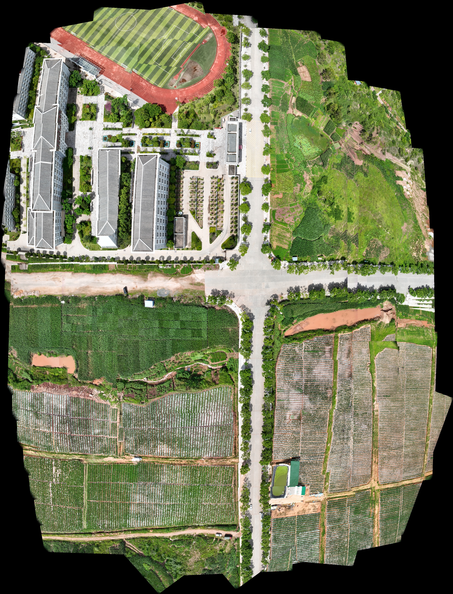
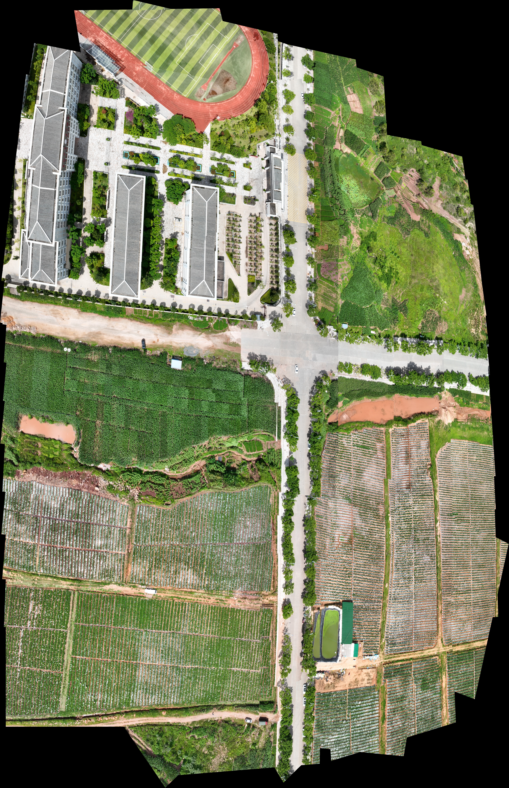
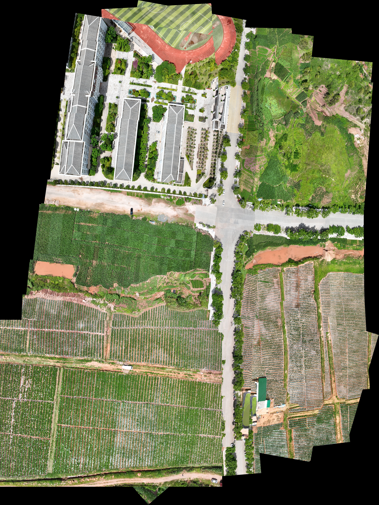

# StereoUAV-Graph-Stitching

Incremental visual-graph registration and binocular UAV image stitching with stereo constraints and global optimization.

This repository collects three related implementations for large-scale UAV image registration and mosaicking:

- `uav_stereo_incremental_visual_graph_global_registration.py`: incremental stereo visual-graph registration with ordinary, tree, strong, and loop edges, followed by global optimization and mosaic rendering.
- `UAV_Binocular_Camera_block_incremental_rigid_stereo_similarity_backbone_core.py`: block-incremental binocular stitching with a rigid stereo similarity backbone.
- `uav_stitching/`: a modular, reproducible stitching pipeline covering metadata association, GPS-neighbor graph construction, feature matching, affine and projective optimization, warping, Graph-Cut seams, blending, and evaluation.

## Repository scope

The repository includes source code, configuration, documentation, and saved results from the GPS-guided and independent visual-graph pipelines. Published results include mosaics, masks, metrics, and selected diagnostic artifacts. Raw input images and the `uav_stitching/cache/` and `uav_stitching/debug/` directories are not included.

See [`uav_stitching/README.md`](uav_stitching/README.md) for GPS-guided pipeline setup, commands, implementation scope, and recorded results. Its dependencies and configuration apply to that subproject; the two standalone scripts have separate entry points.

## Results

### GPS-guided stitching

The `uav_stitching` pipeline uses GPS metadata to construct the image-neighbor graph before global affine/projective registration and Graph-Cut blending. Metrics, masks, and reduced-size validation runs are available in [`uav_stitching/outputs`](uav_stitching/outputs).

### Incremental visual-graph registration

The independent visual-graph pipeline builds and optimizes image-registration edges directly. Its full run artifacts—including graph diagnostics, transforms, verification summaries, masks, and mosaics—are available in [`out_new_visual_graph`](out_new_visual_graph). See the [implementation report](out_new_visual_graph/implementation_report.md) for details.

Projective result:

Affine result:

## Reference paper

Zhongxing Wang, Zhizhong Fu, and Jin Xu, “Large-scale UAV image stitching based on global registration optimization and graph-cut method,” *Journal of Visual Communication and Image Representation*, vol. 107, article 104354, 2025.

- DOI: [10.1016/j.jvcir.2024.104354](https://doi.org/10.1016/j.jvcir.2024.104354)
- Publisher page: [ScienceDirect](https://www.sciencedirect.com/science/article/pii/S1047320324003109)
