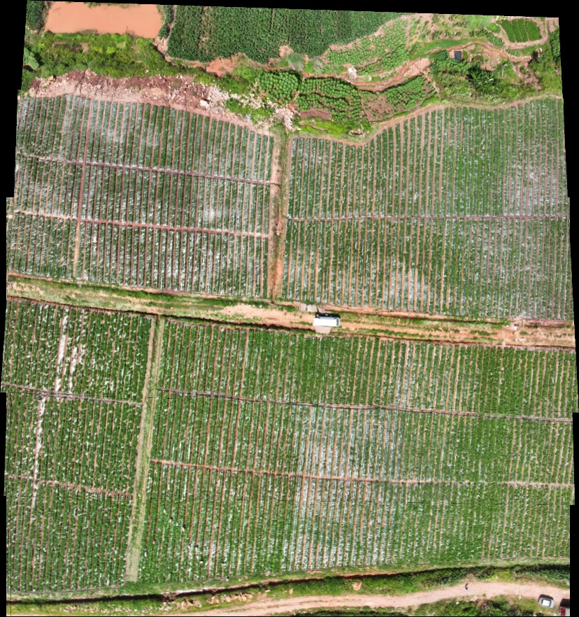
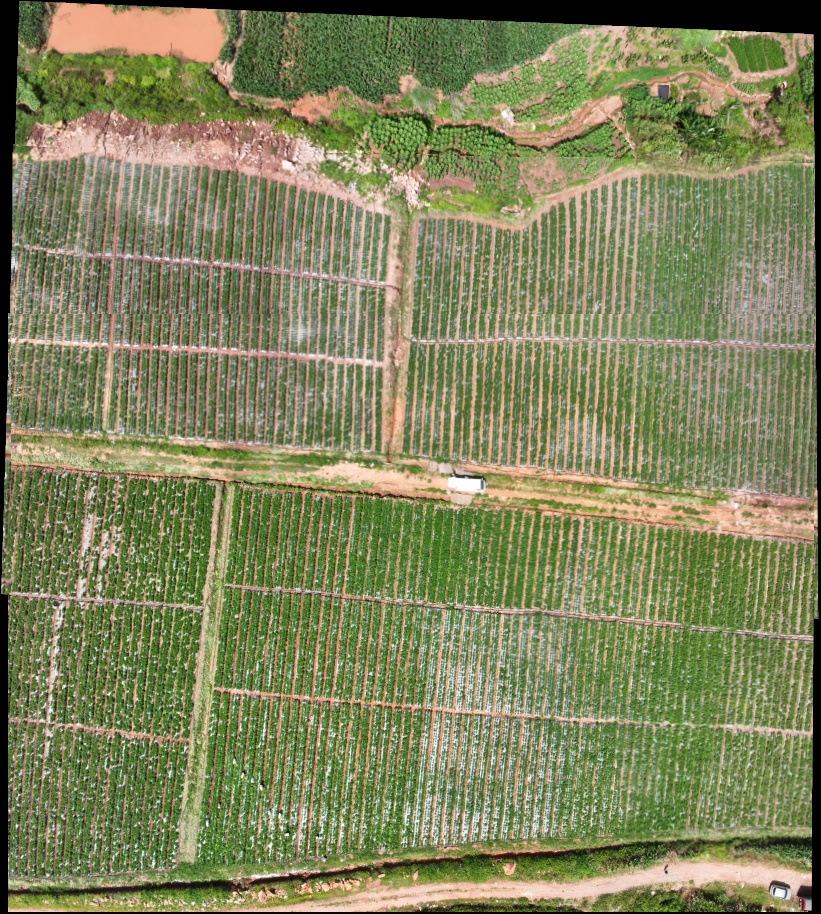

# Refactor validation

Validation was performed on 2026-09-11. The working versions of the original two
scripts were preserved outside the repository before editing. The baseline includes
the user's existing visual-graph default-path changes.

## Automated checks

- **25 regression tests passed**: the original 18 visual-graph tests plus seven
  backbone tests covering typed block topology, unconstrained parallel stereo
  displacement, parameter packing, similarity/correction decomposition, safety
  penalties, residual dimensions, and two-block observation multiplicity.
- **163 functions/classes compared structurally**: 100 backbone definitions and 63
  visual-graph definitions retain their computational AST after normalizing module
  configuration references and excluding documentation/error-message translations.
  CLI entry points and the self-test class's import/path adaptation are outside
  this structural comparison.
- A wheel was built and installed into an isolated target directory. Both installed
  package CLIs load and expose their documented options. Root compatibility entry
  points remain available without an editable install.
- Ruff import/error checks and formatting checks passed. Maintained repository text
  was checked for remaining Chinese characters and broken local Markdown links.

## Real-image differential integration check

The first three consecutive pairs from the local `data_set_5` input were resized
to an 800-pixel longest side and renamed with purely numerical stems. Both original
and refactored backbone pipelines received identical images, random seeds, one
OpenCV thread, default numerical settings, and ordered-overwrite compositing.

Both completed two blocks and produced final six-image mosaics. All **41 output
artifacts** were checked: CSV schemas and non-path text fields match, numerical
fields match within `rtol=atol=1e-10`, and final mosaic pixels are exactly equal.
Output-directory paths necessarily differ and were excluded from text comparison.

The reorganized visual-graph pipeline also completed feature extraction, graph
construction, global similarity/projective registration, and rendering on these
six images. It produced one component with nine optimization edges. All-inlier
RMSE was **2.9441 → 1.8110 → 1.3389 pixels** in the resized input coordinate system.
This short sequence does not exercise long-range real-image retrieval; synthetic
topology tests cover the relevant selection and retention rules.

### Smoke renderings

Backbone (ordered overwrite):

Visual graph (projective registration and Graph-Cut):

Both images were opened for inspection. They show the expected field coverage;
local row offsets, visible seams, and irregular boundaries remain. Pixel equality
between the old and new backbone renderings establishes refactor equivalence,
not that the original geometry is error-free. These previews do not establish a
controlled accuracy ranking between the algorithms.

Machine-readable evidence and hashes are in
[`results/validation`](../results/validation).

## Archived experiment and limits

The archived 140-image visual-graph outputs were relocated without changing their
data or image contents; their report was rewritten in English. Their recorded
4.522-pixel projective RMSE remains a historical result. No new full-resolution,
full-sequence benchmark was run for this repository cleanup.

The refactor does not resolve existing model limitations: projective parallax,
center-based stereo approximations, duplicate shared stereo weighting, limited
backbone optimization horizon, and possible discontinuity after failed blocks.
See [algorithm definitions](algorithms.md). Performance, memory use, and geographic
accuracy have not been benchmarked by these checks.
