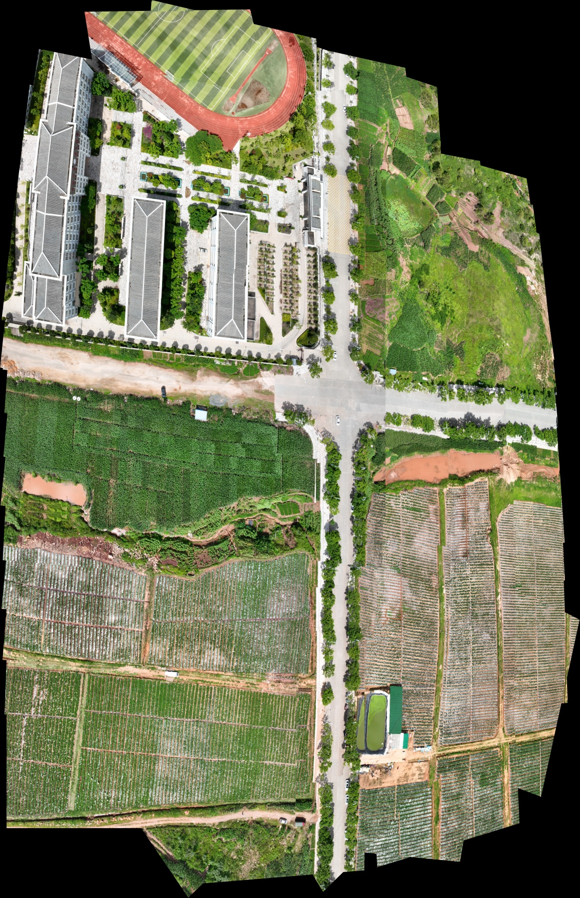

# UAV 双目增量视觉图与全局配准实现报告

## 实现范围与复现命令

Program: `uav_stereo_incremental_visual_graph_global_registration.py` (repository root).

从空文件编写；未读取、修改、复制或继承以前的 Python 拼接程序。方法依据本次粘贴的完整规格与本目录 `paper.markdown`。该 Markdown 是论文方法摘要；公式、归一化、参数值与图构建细则以本次明确给出的规格为准。

Activate an environment containing this standalone script's dependencies, then run the following commands from the repository root. Machine-specific paths in this report and the accompanying text logs have been normalized for publication; recorded metrics are unchanged.

```powershell
python uav_stereo_incremental_visual_graph_global_registration.py --self-test
python uav_stereo_incremental_visual_graph_global_registration.py
```

默认读入同目录 `data_set_5\left`、`data_set_5\right`，输出至 `out_new_visual_graph`。支持 `--left`、`--right`、`--output`。已有最终图时默认拒绝覆盖，重做整个实验应指定新的输出目录。

```powershell
# 使用本程序保存的最终图重新执行配准与渲染，校验输入路径、大小、修改时间和非渲染配置；仅显示/接缝像素上限允许变化。
python uav_stereo_incremental_visual_graph_global_registration.py --resume-graph
```

运行依赖仅 NumPy、OpenCV、SciPy、pandas 与 Python 标准库；无深度学习框架或外部优化后端依赖。

## 23 项实现说明

| 项目 | 实现与证据 |
|---|---|
| 1. 新文件路径 | 见报告首行；全部算法、自测和 CLI 均在一个独立 `.py` 中。 |
| 2. 总代码行数 | 最终文件实际 1754 行。 |
| 3. left/right 同步 | 扫描指定两侧目录，按 `r"^(\d+)"` 提取前导 frame id，取交集并升序处理。某侧缺失明确 warning 并跳过；同一侧重复 id 抛出歧义错误，不猜测对应关系。 |
| 4. 增量 retrieval | 每张图从同一 SIFT 缓存取 response 最高的最多 500 个 descriptor；每对最多 1000 个。OpenCV FLANN 每个 train matrix 对应一个历史 pair。新 pair 先 query、后 add；k=2、ratio=0.8；按 votes 为主、逆距离加权分为次序，最多 Top-20。排除流位置相差小于 10 的 pair，保存 votes、归一化 score 和 weighted_score。独立检索接口可替换。 |
| 5. Sequential candidates | 按同步后的升序流位置尝试 t−1、t−2、t−4，历史位置存在才尝试。文件编号有跳号时仍按采集流顺序处理。 |
| 6. 四组合验证 | `verify_pair_relation` 对 LL、LR、RL、RR 全部调用相同 verifier，无提前通过短路。双向 KNN Lowe ratio 后取 mutual consistency，再做 RANSAC、内点数、比例、重投影误差、两侧凸包面积覆盖率门控。候选或未选中的 verified relation 不进入优化。 |
| 7. Tree connectivity | 每个新 pair 优先选择已验证 sequential 中最高 relation_score 的 parent；全部 sequential 失败才允许 retrieval parent。枚举最多两条实际验证边的 subset，先最大化新 pair 到历史图可连接侧数，再最大化 endpoint coverage 和质量；可通过已验证 intra-pair 边连通另一侧。tree 永久保留。无法连通时输出 deferred，不伪造边；最终按单图连通分量分别优化。 |
| 8. Strong pruning | 每个新 pair 最多新增两条非 parent、非已选 loop 的 strong relation；strong degree 超过 4 时删除接触超限节点的最低分 strong role。tree、loop role 与其 materialized observation 保留。最终优化图从裁剪后的 topology 重新生成。 |
| 9. Loop 选择 | 仅远时距 retrieval relation 有资格；已作为 parent 的关系由 tree 永久保留，loop 从其余 retrieval relation 选择，避免同一 relation 多次选边超过两条。每条实际用于 loop 的 image edge 还必须通过 50 内点、0.35 比例、2.5 px 误差和 0.05 覆盖率门控。最多选两条 loop relation，永久保留。默认最佳一条 image edge；第二条质量至少为最佳的 0.8 且增加 endpoint coverage 才保留。 |
| 10. 全部 ordinary | `ImageEdge` 没有 edge_type，左右图只影响候选拓扑。所有优化边统一使用两个端点经 H 变换后的点差；包括 intra-pair 边，均没有额外残差、先验或特殊权重。 |
| 11. Dedup 与方向 | 排序后的 image-key pair 仅作字典 identity，不重排实际端点。相同 identity 保留质量更好的 observation，合并 roles。明确反向操作同时交换 keys、两组全部/选中点、coverage，并逆转 H、重新计算方向相关误差。assert 检查 H 将所属端点点集映射到另一端。 |
| 12. 均匀点选取 | 原始 source 内点 bbox 近似重叠区，划分 rows×cols 网格，每个非空格随机取一条；不足 P 从未选内点无放回补足。seed=7 加稳定端点标识保证重复性。选中两侧点始终使用同一索引；少于 P 拒绝。 |
| 13. 本数据 P | 70 对、140 张，P=40，5×8 网格。超过 300 张切换 P=20、5×4 网格。 |
| 14. Affine 矩阵 | `[[a,b,c],[-b,a,f],[0,0,1]]`，每个非固定图仅 `[a,b,c',f']` 四个变量。 |
| 15. Affine sparse solver | 每条边组装 P 个二维点差的稀疏线性系统 A x=b，固定 Identity 参考贡献移到右端。CSR+LSMR，平移列乘 5000；不使用非线性优化求线性问题。各 component 独立求解。 |
| 16. Projective 8DoF | `[[a,b,c],[d,e,f],[g,h,1]]`；打包 `[a,b,c',d,e,f',g,h]`。初值严格来自 global affine，初始 g=h=0。优先最早 left 作固定 Identity reference。 |
| 17. Eq.(16) rigid | 对最终 H 逐项计算 `q1=ab+de`、`q2=a²+d²−1`、`q3=b²+e²−1`、`q4=g²+h²`，能量为各 q 的平方之和。没有坐标归一化或额外变换分解。 |
| 18. Eq.(17)/(18)/(19) normalization | 每个 component 使用自己的 M、N 和固定 P。点差 residual 乘 `1/sqrt(MP)`；rigid residual 乘 `sqrt(800/N)`。平方和严格等于 `E_match/(MP)+800 E_rigid/N`。Identity rigid 为零，省去其四个零 residual。未新增其他 objective 项；loss=linear。 |
| 19. sigma_tr=5000 | pack 时 c、f 除以 5000，unpack 还原乘以 5000。解析 Jacobian 的平移列相应为 5000/w。变换矩阵和坐标本身仍是原图像素数学定义。 |
| 20. Analytic sparse Jacobian | 解析求点变换与 rigid 导数，两个端点符号分别为正、负，再乘归一化系数，组装 CSR；TRF+LSMR，x_scale=jac，max_nfev=500，verbose=2。有限差分相对误差见自测结果。 |
| 21. Self-tests | 内置 `--self-test`，实际执行日志与逐项 PASS/FAIL 在 `self_test.log`、`self_test_results.json`。涵盖用户要求的 11 项，并扩展 mutual matching、增量历史检索、严格 loop、dedup 与 GraphCut mask union。 |
| 22. GraphCut | OpenCV 5.0.0 已检测到 `detail_GraphCutSeamFinder("COST_COLOR_GRAD")`，执行 current mosaic + next warped image 的逐图 seam finding。属于 OpenCV 的工程实现，不声称复现论文作者内部代码。不可用或该图调用失败时明确 warning 并记录 hard-overlay 次数。GraphCut 不修改 H，不做曝光补偿、色彩迁移或 multi-band blending。 |
| 23. 输出列表 | 见下文，包含全部要求的 CSV、两张最终 mosaic、完整日志、原始/选中 observation 与实验摘要。 |

## 评价与显示约定

- 主指标使用最终优化图每条边保存的**全部 RANSAC 内点**，按所有点总体汇总欧氏投影误差。报告 RMSE、mean、median、P90、P95、max。另行报告 selected-P 指标，不将其冒充所有内点指标。
- `initial` 是最终图中观测 H 的确定性遍历累积，仅用于优化前诊断。它不作为 Stage B 初值；Stage B 严格使用 Stage A 最优结果。
- 固定同一组最终优化边和点，比较 initial、affine、projective。该误差是视觉内部一致性，不是独立地面真值误差。
- 若有多个 component，各分量在各自 Identity gauge 下优化并分别渲染，最大分量另存为 main mosaic，不按未知关系摆放不同分量。
- 所有特征、优化与误差均使用输入图原始像素分辨率。本数据单图为 2640×1978。
- 为限制渲染内存，默认 mosaic 最多约 3000 万像素、最长边 16000；同一 component 的 affine/projective 使用共同显示比例。显示用 `view_transform` 与 final H 分别保存，final H 不变。实际尺寸、比例、画布覆盖率在 `mosaic_summary.json`。
- GraphCut 在逐图局部区域执行；局部区域超过 **25 万像素**时，仅 seam 求解图缩小后将 seam mask 最近邻映回，最终像素来自对应 mosaic 显示尺度的 warped image。该渲染资源选项不参与配准；可在 Config 中调整。初始 100 万像素试渲染前 10 张耗时 84.6 秒，因此改用 25 万像素并重跑两张最终 mosaic。原图构建、所有匹配观测均保留；未重提 SIFT，配准指标不变。
- signed epsilon 仅处理函数内 `|w|<1e-10` 的除法。投影极点穿过某张图时无法构造有限画布，渲染会明确失败，不添加代价或更改 H。

## 输出文件

```text
out_new_visual_graph/
    implementation_report.md
    self_test.log
    self_test_results.json
    run.log
    graph_build_and_initial_render.log
    run_resume.log
    run_summary.json
    data/
        pair_topology_graph.csv
        image_optimization_graph.csv
        matching_diagnostics.csv
        retrieval_candidates.csv
        pair_registration_status.csv
        input_manifest.csv
        graph_config.json
        graph_summary.json
        optimization_observations.npz
        initial_traversal_transforms.csv
        global_affine_transforms.csv
        global_projective_transforms.csv
        edge_registration_metrics.csv
        registration_metrics_summary.csv
        optimizer_summary.csv
        mosaic_summary.json
        verification_summary.json
    mosaics/
        global_affine_mosaic.jpg
        global_affine_mosaic_mask.png
        global_affine_mosaic_preview.jpg
        global_projective_mosaic.jpg
        global_projective_mosaic_mask.png
        global_projective_mosaic_preview.jpg
```

其中 `optimization_observations.npz` 保存全部内点、选中 P 点和观测 H，便于独立核验或显式重跑后半段。`image_optimization_graph.csv` 一行对应一条最终实际参与优化的边；`matching_diagnostics.csv` 同时保留被拒绝的验证尝试及原因。

## 实际实验结果

最终独立代码共 **1754 行**。70 对/140 张全部处理，1830 次单图匹配验证中 923 次通过普通门控，907 次被拒绝；最终拓扑只选择 478 条优化边，不将全部验证结果直接送入优化。全部 140 张图的 SIFT 提取次数为 1，且 478 条边均严格选用 40 点。

### 图统计

| 统计项 | 实测 |
|---|---|
| num_stereo_pairs | 70 |
| num_images | 140 |
| intra_pair_edges | 70 |
| total_optimization_edges | 478 |
| image_graph_connected_components | 1 |
| degree_min | 3 |
| degree_mean | 6.828571428571428 |
| degree_median | 7.0 |
| degree_max | 11 |
| pair_tree_relations | 69 |
| image_tree_edges | 138 |
| pair_strong_relations | 85 |
| image_strong_edges | 161 |
| pair_loop_relations | 64 |
| image_loop_edges | 109 |
| sequential | 203 |
| retrieval | 237 |
| verified | 225 |
| pruned_strong | 2 |

全部 69 条 tree parent 来自 sequential 验证，所有 pair 到达时均连通。实际图没有触发 tree-parent/retrieval-loop 重复选边的边界情况。最终 strong degree 最大为 4，每条跨 pair relation 最多 2 条 image edge；最终单图图只有 1 个 component。各项持久化检查见 `data/verification_summary.json`。

### 全部内点主指标

单位均为原始输入图像素；总共 686,705 对 RANSAC 内点。

| 阶段 | RMSE | mean | median | P90 | P95 | max |
|---|---|---|---|---|---|---|
| initial | 215.148866 | 100.099250 | 33.023497 | 228.083586 | 532.520951 | 1317.750138 |
| affine | 16.828046 | 8.487813 | 4.387740 | 17.209826 | 27.435618 | 256.418063 |
| projective | 4.522367 | 3.091986 | 2.027199 | 6.793654 | 9.202817 | 79.976654 |

优化实际使用 19,120 对 selected-P 点，其 RMSE 如下。每条边在优化中有相同点数，因此与按全部内点数量加权的主指标不同。

| 阶段 | selected-P RMSE |
|---|---|
| initial | 228.082207 |
| affine | 31.988986 |
| projective | 8.777631 |

### 投影能量与求解器

| 能量项 | before | after |
|---|---|---|
| data_energy | 1023.295217939700 | 77.046805640143 |
| rigid_energy | 0.547506801061 | 0.035706690372 |
| global_energy | 1461.300658788890 | 105.612157937804 |

`rigid_energy` 是未乘 800 的 E_rigid/N。已从最终 CSV 重建 H 并独立重算上述能量，与 solver 输出一致；`2*cost = global_energy`。固定 reference 为 left:0，全部最终 H 有限。

- affine LSMR：迭代 305 次，状态 2。
- projective：nfev=89，njev=88，cost=52.806078968902，optimality=12.227411311，status=2。
- 终止原因：``ftol` termination condition is satisfied.`。这是 ftol 收敛，不是全局最优性的证明。
- 最终重跑的 affine 用时 0.145 秒，projective 用时 8.375 秒；首次增量图构建约 673 秒。初始大接缝画布试渲染不计入最终两张图的渲染用时，原始日志保留于 `graph_build_and_initial_render.log`；最终完整后半段日志为 `run_resume.log`。

### 自测与代码审查

**18/18 PASS，0 failures，0 errors，0 skips**。解析 Jacobian 对中央有限差分的整体相对误差为 **1.111×10⁻¹⁰**，最大列相对误差为 **1.413×10⁻¹⁰**；7 张合成图全部内点 RMSE 从 5.077674 px 降到打印精度下的 0.000000 px。

| 自测 | 结果 |
|---|---|
| test_affine_sparse_recovery | PASS |
| test_all_edges_are_ordinary | PASS |
| test_candidate_is_not_optimization_edge | PASS |
| test_dedup_roles_and_orientation | PASS |
| test_existing_run_is_not_overwritten | PASS |
| test_graphcut_mask_union | PASS |
| test_loop_strict_gate_and_second_edge | PASS |
| test_mutual_ratio_matching | PASS |
| test_ordinary_edge_orientation | PASS |
| test_pair_relation_materialization | PASS |
| test_projective_analytic_jacobian | PASS |
| test_projective_objective_exact_terms | PASS |
| test_projective_recovery | PASS |
| test_retrieval_is_incremental | PASS |
| test_retrieval_parent_materializes_at_most_two_edges | PASS |
| test_strong_edge_culling | PASS |
| test_tree_connectivity | PASS |
| test_uniform_P_selection | PASS |

独立只读审查核对了 ordinary 边、稀疏仿射、原始 H 的 rigid 四项、归一化、Jacobian、分量隔离与 GraphCut。发现的两项问题已修复并新增回归测试：限制 tree/loop 合并后最多两条 image edge；已有结果被拒绝重跑时保留旧日志。审查员复核这两项修复后关闭问题。

### 局部误差仍需注意

整体 RMSE 不代表每条边都同样准确。按投影后 P95 排序的前五条边如下；程序保持用户指定目标函数，没有为了降低这些局部误差加入额外先验。

| image i | image j | roles | RMSE | P95 |
|---|---|---|---|---|
| right:38 | right:37 | strong | 38.133 | 66.451 |
| left:33 | left:23 | loop | 25.365 | 46.408 |
| left:18 | left:8 | loop | 14.698 | 36.782 |
| right:30 | right:26 | strong | 18.710 | 34.141 |
| right:9 | right:7 | strong | 18.747 | 33.424 |

### 最终渲染与视觉检查

两张图均已直接打开检查，并额外查看两个较大残差区域的原尺寸局部对照。

| 输出 | 尺寸 | GraphCut 次数 | fallback | 渲染耗时 |
|---|---|---|---|---|
| affine | 3733×4959 | 139 | 0 | 58.254 s |
| projective | 4406×6812 | 139 | 0 | 71.953 s |

共同显示比例为 **0.828754547518**，接缝求解上限为 250,000 像素。两张图尺寸不同是 affine/projective 投影范围不同造成的，显示像素比例相同。画布有效覆盖率分别为 79.22% 和 82.51%；这只是本图画布占用比例，不是真值地理覆盖率。

最终配准与两张图渲染的显式重跑用时 140.235 秒，正常退出 `RUN_COMPLETED`。所有要求的 CSV 与两张 mosaic 均存在且可解码；最终 H、参考 gauge、能量重算、图边上限、SIFT 次数和渲染记录检查全部通过。

**直接视觉观察：** 投影版中学校建筑、中央道路和大块田垄整体连续；`left:33—left:23` 对应田垄区域在仿射图中有明显的局部错接，投影图的田垄连续性改善。右侧植被/小地块区域仍能看到部分接缝与亮度变化，外边界保留由各张图覆盖范围形成的阶梯和不规则轮廓。没有裁成规则矩形，也未做曝光优化，不能把 4.52 px 的总体误差解释成处处无缝。

局部对照保存在：

- `visual_checks/edge_right_38_right_37.jpg`
- `visual_checks/edge_left_33_left_23.jpg`
- `visual_checks/crop_locations.json`（每个 crop 在对应最终 mosaic 内的确切位置）

局部对照采用相同的输出像素尺寸，并按相应 observation 区域定位；由于两种全局变换的局部缩放不同，裁剪所涵盖的地面范围不会完全相同。

最终投影预览：



