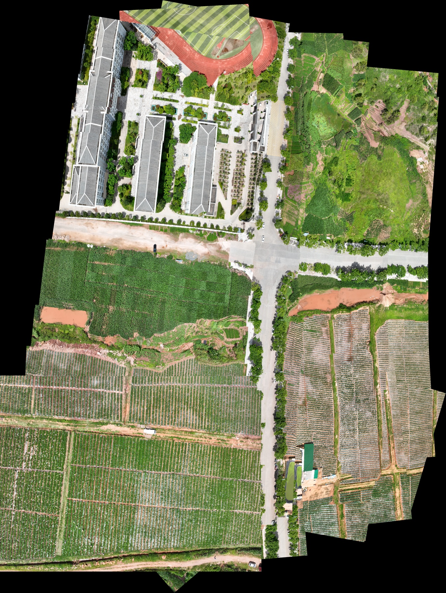

# Archived visual-graph experiment

This report describes the saved pre-refactor experiment. Source code is now in
[`src/stereo_uav/visual_graph`](../../src/stereo_uav/visual_graph), with its original
root script retained as a compatibility entry point. The data and image artifacts
were relocated without changing their numerical or pixel contents. This report
was rewritten in English and updated to distinguish historical evidence from
current refactor checks.

## Inputs and graph

The original experiment processed non-distributed inputs now represented as
`data/left` and `data/right`: 70
synchronized stereo pairs and 140 images. The final image graph contains 478
ordinary optimization edges and one connected component. Its pair topology has
69 tree relations, 85 strong relations, and 64 loop relations. Image role counts
are 138 tree, 161 strong, and 109 loop edges, plus 70 intra-pair observations.
Roles describe selection and retention; all numerical constraints are ordinary.

Each optimization edge contributes 40 spatially selected matches from a 5-by-8
source grid. The all-inlier evaluation uses 686,705 retained RANSAC correspondences;
the selected-point evaluation uses 19,120 correspondences.

## Recorded registration errors

| Stage | All-inlier RMSE (px) | Selected-point RMSE (px) |
|---|---:|---:|
| Traversal initialization | 215.149 | 228.082 |
| Global similarity (`affine`) | 16.828 | 31.989 |
| Global projective | 4.522 | 8.778 |

These figures come from [run_summary.json](run_summary.json) and
[data/registration_metrics_summary.csv](data/registration_metrics_summary.csv).
Different correspondence populations explain why selected-point and all-inlier
metrics differ; the evaluation is not against independent geometric ground truth.

The implementation uses a sparse linear similarity stage followed by an
8-parameter projective stage with the four global-matrix regularization terms
described in [the algorithm document](../../docs/algorithms.md).

## Local residuals

A pooled RMSE can conceal less accurate overlaps. The archived projective
all-inlier edge statistics include:

| Image i | Image j | Role | RMSE (px) | P95 (px) |
|---|---|---|---:|---:|
| right:38 | right:37 | strong | 38.133 | 66.451 |
| left:33 | left:23 | loop | 25.365 | 46.408 |
| left:18 | left:8 | loop | 14.698 | 36.782 |
| right:30 | right:26 | strong | 18.710 | 34.141 |
| right:9 | right:7 | strong | 18.747 | 33.424 |

## Rendering

| Stage | Canvas (pixels) | Graph-Cut seams | Hard-overlay fallbacks | Recorded rendering time |
|---|---|---:|---:|---:|
| Similarity | 3733 x 4959 | 139 | 0 | 58.254 s |
| Projective | 4406 x 6812 | 139 | 0 | 71.953 s |

Both renderings use scale 0.828754547518 and a 250,000-pixel seam-solver limit.
Canvas occupancy is 79.22% and 82.51%, respectively; these values are fractions of
rendered canvas pixels, not geographic coverage measurements. The saved replay
completed in 140.235 seconds including registration and both renderings.

The prior visual inspection recorded improved field-row continuity in the
projective result, especially near the left:33 / left:23 overlap. Local brightness
and seam differences remain visible on vegetation and small plots. The boundary
retains a stepped, irregular footprint; exposure optimization and rectangular
cropping were not performed. The overall RMSE must not be interpreted as a
claim of seamless alignment everywhere.

Selected comparisons are in [visual_checks](visual_checks). Crop coordinates are
recorded in [crop_locations.json](visual_checks/crop_locations.json). Equal output
crop dimensions do not imply identical ground coverage when local transform
scales differ.




## Reproduction and evidence boundaries

For a new run, provide the raw synchronized images explicitly:

```sh
python uav_stereo_incremental_visual_graph_global_registration.py --left data/left --right data/right --output outputs/visual_graph_full
```

The original self-test suite passed 18 tests. Current refactor checks are reported
separately in [validation.md](../../docs/validation.md). This archived full run was
not repeated solely to reorganize the repository. Published provenance contains
historical paths and file metadata; replay requires matching original inputs and
configuration, not merely the presence of the archived observation file.
